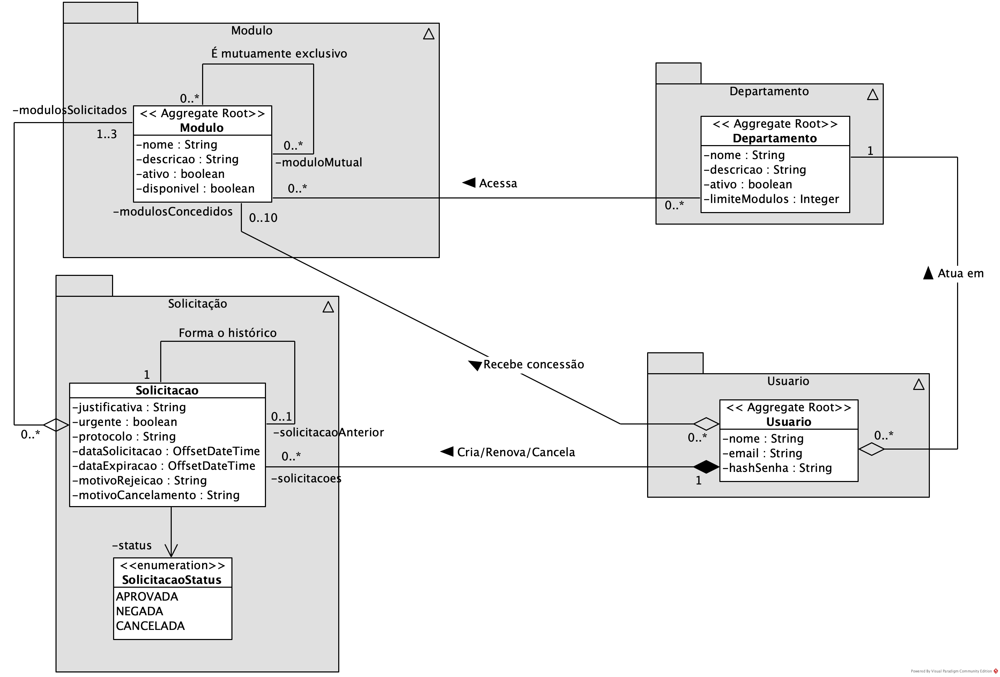
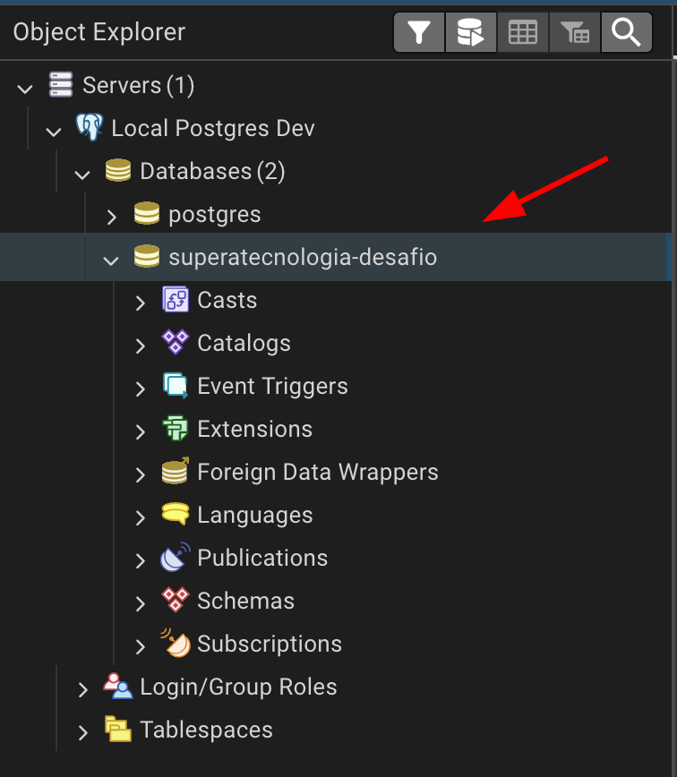

# SuperaTecnologia API *(Desafio Java Pleno)*

Projeto Java com Spring Boot, realizado como teste técnico para desenvolvedor Java Pleno na SuperaTecnologia.

## Índice
- [Sobre](#sobre)
- [Obtendo o projeto](#obtendo-o-projeto)
- [Como executar](#como-executar)
	- [Pré-Requisitos](#pré-requisitos)
	- [Com build da imagem e proxy (Padrão)](#com-build-da-imagem-e-proxy)
	- [Sem build da imagem](#sem-build-da-imagem)
		- [Executando o app Spring Boot](#executando-o-app-spring-boot)
- [Acessando a Documentação e Testando a API](#acessando-a-documentação-e-testando-a-api)
- [Testes Unitários, de Integração e relatório JaCoCo](#testes-unitários-de-integração-e-relatório-jacoco)
- [Acessando a interface de gerenciamento do banco de dados (PgAdmin)](#acessando-a-interface-de-gerenciamento-do-banco-de-dados-pgadmin)
- [Decisões Arquiteturais (ADRs Simplificados)](#decisões-arquiteturais-adrs-simplificados)
- [Pontos de melhoria](#pontos-de-melhoria)
- [Detalhes do projeto](#detalhes-do-projeto)

## Sobre
Projeto Java com Spring Boot, realizado como teste técnico para desenvolvedor Java Pleno na SuperaTecnologia.

Este projeto simula uma API para gerenciamento de **Solicitações** de acessos a **Módulos** de um sistema (Permissionamento dinâmico), realizado por usuários devidamente autenticados, que necessitam de acesso temporário a determinados Módulos (compatíveis com o Departamento em que atuam), onde a concessão ou rejeição é realizada automaticamente pelo sistema de acordo com diversos parâmetros e regras.

Este projeto foi realizado de acordo com os requisitos fornecidos em: https://github.com/superatecnologia/desafio-vaga-java-pleno

Utiliza referências de:
- https://github.com/leoarj/algaworks-esr
- https://github.com/leoarj/algaworks-idk
- https://github.com/leoarj/algaworks-java-ej

### Breve diagrama de classes - DDD


### Tecnologias e ferramentas utilizadas

- Plataforma: Java 21 LTS (*OpenJDK Temurin*)
- Spring:
	- Spring Boot
	- Spring Data
		- Spring Data JPA
			- Hibernate ORM
    - Spring Security
- Suporte a métodos padrão: Lombok
- Versionamento de DB e migrações: Flyway
- Mapeamento DTO: ModelMapper
- Criptografia de senhas: BCrypt (possio salt embutido)
- Build e empacotamento: Maven
- DB: PostgreSQL 17
- IDE: IntelliJ Community
- Testes e doc. de API:
	- Postman
	- Spring Doc (Swagger)
- Versionamento: Git
    - Modelo de *braching*: *Git Flow*
- Proxy reverso e LB: Nginx
- Containerização
	- Docker

## Obtendo o projeto

- Realize o clone do repositório:
    ```console
	git clone https://github.com/leoarj/superatecnologia-desafio-java-pleno.git
	```
- Acesse a pasta do projeto:
    ```console
	cd superatecnologia-desafio-java-pleno
	```

## Como executar

Abaixo seguem os passos para a execução da aplicação.

### Pré-requisitos

#### Ambiente de execução

Devido ser uma aplicação containerizada, a forma mais fácil de executar este projeto é utilizando o Docker.

- Ter o Docker (https://www.docker.com/) instalado no computador.
- Demais dependências: Automaticamente gerenciadas pelo build dos containers.

#### Configuração de variáveis de ambiente

- Renomear o arquivo de template do `.env` pelo terminal:
    ```console
	mv .env.template .env
	```

- Ou copiar o arquivo `.env.template` e renomear a cópia para apenas `.env` e substituir os valores necessários.
	>As variáveis que devem ser configuradas estão documentadas dentro do arquivo.
  
### Com build da imagem e proxy

(Simulando Ambiente de Produção - Com containerização - Com proxy - Com provisionamento de 3 instâncias)

- Diretamente com `docker compose`
	- Subir os containers
	```console
	docker compose -f docker-compose.yml up --build --scale supera-api=3
	```
	- Parar os containers
	```console
	docker compose -f docker-compose.yml down
	```

- A partir do `Makefile`
	- Subir os containers
	```console
	make up-prod
	```
	- Parar os containers
	```console
	make down-prod
	```
	- Outras opções como logs e listagem dos containers estão presentes no `Makefile`, bastando digitar o comando abaixo para obter ajuda
	```console
	make help 
	```

#### Detalhes das etapas efetuadas com `docker-compose.yml`
A partir desse modo de execução, será realizado o build da imagem da aplicação Java de forma *multi-stage (build/runtime)*, onde:

1. Será levantado o servidor de banco de dados (PostgreSQL 17).
2. Será levantado o serviço da interface de gerenciamento de banco de dados (PgAdmin).
3. Será contruído e levantado o proxy reverso (Nginx), com configuração personalizada, para balanceamento de carga (Nativo round-robin do Docker e integrado automaticamente ao Nginx).
4. Será construído (multi-stage) e levantado o serviço referente à aplicação Java/Spring, provisionando 3 instâncias.

### (Opcional) - Sem build da imagem

(Ambiente local - IDE - Sem proxy)

- Subir os serviços necessários (Postgres e PgAdmin)
	- Diretamente com `docker compose`
		```console
		docker compose --env-file .env.dev -f docker-compose-tools.yml up
		```
	- A partir do `Makefile`
		```console
		make up-dev-tools
	
		```
#### Executando o app Spring Boot

- Executando a aplicação a partir do plugin do *Spring Boot* para *Maven*:
	```console
	./mvnw spring-boot:run -Dspring-boot.run.profiles=dev-local -DskipTests
	```

- Executando a aplicação com `java -jar`:
	```console
	./mvnw clean package -DskipTests
	```
	```console
	java -Dspring.profiles.active=dev-local -jar target/superatecnologia-desafio-api-0.0.1-SNAPSHOT.jar
	```

- Após finalizar o desenvolvimento, finalizar o ferramental
	- Diretamente com `docker compose`
		```console
		docker compose --env-file .env.dev -f docker-compose-tools.yml down
		```
	- A partir do `Makefile`
		```console
		make down-dev-tools
		```

## Acessando a Documentação e Testando a API

### Credenciais de acesso

Para auxílio nos testes manuais, estão listados abaixo os **usuários** padrão carregados no sistema.

| Departamento | E-mail |Senha | Descrição |
| ---------- | ---------- |---------- | ---------- |
| Admin (TI) | admin.ti@empresa.com | 123456 | Acesso total e auditoria |
| Financeiro | ana.fin@empresa.com | 123456 | Acesso a módulos financeiros |
| RH | carlos.rh@empresa.com | 123456 | Acesso a gestão de pessoas |
| Operações | beto.ops@empresa.com | 123456 | Acesso a Portal, Relatórios, módulos de estoque |

### Como testar

#### Fluxo principal de testes
1. Realizar uma requisição POST em `/v1/auth/login` usando as credenciais acima.
2. Copiar o token retornado.
3. No ***Swagger***, clique no botão ***Authorize*** e cole o token.
4. No ***Postman***, vá na aba Authorization e seleciona Bearer Token e cole o token no campo apropriado.

### Documentação e Testes - Swagger/OpenAPI

A documentação da API pode ser acessada pelos links listados abaixo, após a inicialização da aplicação.

O acesso pode ser realizado tanto para fins acesso à **documentação**, como também para **testes** da API.

- Acessar a documentação, com proxy (Padrão): http://localhost/swagger-ui.html
- Acessar a documentação, sem proxy (Local, IDE): http://localhost:8080/swagger-ui.html

### Testes - Postman
Está incluso no projeto a pasta `.postman` com a *collection* necessária para testar os endpoints da API.

- Importando o arquivo no Postman:
	- Selecione o arquivo `/.postman/SuperaTecnologia-API.postman_collection.json` e realize a importação dentro do Postman.
	
## Testes Unitários, de Integração e relatório JaCoCo

Os testes unitários e de integração são obrigatoriamente executados ao se gerar imagem da aplicação.

Caso deseje apenas rodar os testes separadamente, seguem os comandos necessários abaixo:

- Testes unitários:
	- `./mvnw test`
- Suíte completa (Unitários e de integração):
	- `./mvnw verify`
- Visualização do relatório JaCoCo:
 - [Relatório JaCoCo em PDF](docs/superatecnologia-desafio-java-pleno.pdf)

## (Opcional) - Acessando a interface de gerenciamento do banco de dados ***PgAdmin***

Para acessar a iterface de gerenciamento do DB via navegador, basta acessar a url abaixo com a porta, usuário e senha previamente configurados no `.env` ou `.env.dev`.

- Exemplo
	```console
	http://localhost:5050/
	```

>Para fins de praticidade, foi utilizado nesse projeto a *feature* de [*Import/Export Servers*](https://www.pgadmin.org/docs/pgadmin4/development/import_export_servers.html#json-format) no PgAdmin através do arquivo `/docker/servers.json` sendo montado em `/pgadmin4/servers.json` no container referente ao PgAdmin.

Dessa forma o servidor de banco de dados já aparecerá registrado automaticamente na ferramenta, **sem necessidade de configuração manual**.



## Decisões Arquiteturais (ADRs Simplificados)

Abaixo estão as principais decisões técnicas tomadas durante o desenvolvimento, seus motivos e impactos.

### 1. Autenticação Stateless com JWT (JSON Web Token)
- **Contexto:** O requisito de balanceamento de carga com múltiplas instâncias da API exige que o estado de autenticação não fique preso a um servidor específico.
- **Decisão:** Utilização de tokens JWT assinados.
- **Impacto:** Permite escalabilidade horizontal (instâncias `app1`, `app2`, `app3`) sem necessidade de replicar sessões (Sticky Session) ou usar um banco de dados de sessão (Redis), simplificando a infraestrutura inicial e atendendo ao requisito de Load Balancing nativamente.

### 2. Versionamento de Banco de Dados com Flyway
- **Contexto:** A necessidade de garantir que o esquema do banco de dados (DDL) esteja sincronizado entre os ambientes de teste, desenvolvimento e produção, especialmente ao subir containers novos.
- **Decisão:** Uso do Flyway para migrações automatizadas.
- **Impacto:** Elimina o risco de o Hibernate (`ddl-auto: update`) criar tabelas em estados inconsistentes. Garante que os dados de teste (inserts iniciais) estejam sempre presentes e versionados.

### 3. Nginx como Proxy Reverso e Load Balancer
- **Contexto:** Expor 3 instâncias da aplicação através de uma porta única e evitar problemas de CORS ou URLs com portas não padrão (8080).
- **Decisão:** Container Nginx configurado com `upstream` apontando para o serviço serviço da API no Docker.
- **Impacto:** O DNS interno do Docker distribui as requisições (Round-Robin) entre as réplicas. O Nginx atua como gateway único.

### 4. Padrão Assembler/Disassembler (ModelMapper)
- **Contexto:** Evitar o acoplamento direto entre as Entidades de Domínio (JPA) e os contratos da API (DTOs/JSON).
- **Decisão:** Implementação de classes Assembler para conversão Entidade -> DTO e Disassembler para DTO -> Entidade.
- **Impacto:** Protege o modelo de domínio de alterações na API e vice-versa (ex: evitar Loop Infinito em JSON bidirecional e LazyInitializationException ao serializar entidades diretamente, não expor toda a estrutura do domínio no corpo das respostas).

### 5. Login Manual vs OAuth2 Authorization Server
- **Contexto:** O escopo do desafio foca na API de Gestão e não na construção de servidor de autenticação completo (AuthServer).
- **Decisão:** Implementação de um endpoint `/login` dedicado que gera JWTs, em vez de subir um stack completo de OAuth2 Server (Keycloak ou Spring Auth Server).
- **Impacto:** Redução drástica da complexidade e tempo de startup da aplicação, mantendo a segurança via Spring Security Resource Server padrão.

### 6. Pipeline de Build com Testes Mandatórios
- **Contexto:** Risco de gerar artefatos de deploy (imagens Docker) contendo regressões ou bugs críticos devido à falta de uso da suíte de testes durante a construção.
- **Decisão:** Remoção da flag `-DskipTests` no estágio de build do Dockerfile. O processo de empacotamento (`./mvnw package`) executa obrigatoriamente todos os testes unitários e de integração (usando banco H2 em memória).
- **Impacto:** Garante que nenhuma imagem Docker é gerada se a aplicação não estiver **verde** (passando em todos os testes), atuando como um ***Quality Gate*** primário.

### 7. Quality Gate de Cobertura de Código (JaCoCo)
- **Contexto:** Necessidade de manter a manutenibilidade e confiabilidade do software a longo prazo, impedindo que novas funcionalidades sejam adicionadas sem a devida cobertura de testes.
- **Decisão:** Configuração do plugin JaCoCo no Maven com regra de validação estrita (check), exigindo no mínimo 80% de cobertura de linhas para sucesso do build.
- **Impacto:** O build falha automaticamente se a cobertura cair abaixo do limite estabelecido, forçando a equipe a escrever testes concomitantes ao desenvolvimento das regras de negócio.

## Pontos de melhoria

### 1. Refatoração das Regras de Validação (Padrão Strategy ou outro)
- Contexto: O método solicitar no CadastroSolicitacaoService concentra diversas regras de negócio (compatibilidade de departamento, mutualidade de módulos, etc.) em uma estrutura procedural. Isso viola o Open/Closed Principle (OCP), pois para adicionar uma nova regra é necessário modificar a classe do Service.
- Melhoria Proposta: Extrair cada validação para uma classe separada que implemente uma interface comum (ex: ValidadorSolicitacao).
- Implementação Sugerida: Utilizar recursos do Spring para injetar automaticamente todas as implementações dessa interface em uma List<ValidadorSolicitacao>, ou recursos do Java como uma lista de `Runnable` etc.

### 2. Enrquecimento do domínio e entidades anêmicas
- Contexto: Entidades estão expondo suas coleções diretamente, o que permite a manipulação direta nelas e faltam métodos de comportamento específicos ao domínio.
- Melhoria Proposta: Ao expor coleções, expor uma cópia e não a própria referência(modificável ou não), atendendo à programação defensiva.
- Implementação Sugerida: Uso de `Collections.unmodifiableSet()`, `Collections.unmodifiableList()` entre outros. Métodos específicos em entidades, como em `Usuário` por exemplo, ter `revogarAcessoAModulos(Set<Modulos> modulosRevogados)` para proteger o acesso direto a sua lista de módulos.

### 3. Exposição dos IDs sequenciais do banco de dados nas URIs
- **Contexto:** Os IDs sequenciais internos do banco de dados estão sendo expostos na URIs dos recursos.
- **Decisão:** Migrar as URIs dos recursos para exposição de ID baseado em padrão aleatório-ordenável.
- **Impacto:** Desencorajar ataques de previsão ("adivinhação") na API
e não expor dados internos do banco de dados diretamente.
- Exemplos:
	- Atual: `/v1/usuarios/1/solicitacoes/1004`
- Canditados:
	- UUID v7: 
		- `/v1/usuarios/019abc36-37cd-7140-82a7-69fa173e2eb4/solicitacoes/019abc36-5d6f-7d75-8594-d83b23c8a7f8`
	- ULID:
		- `/v1/usuarios/00000001Z9RZ49V7DSEN99DKSZ/solicitacoes/00000001Z9HZRT0ZD0Q6ZPH6N2`
- Sugestões de implementação:
	- Coluna `public_id` ou `external_id` nas tabelas, para para exposição na API e busca por esse campo. Obs.: Mantendo o relacionamento entre as tabelas via ID sequencial do banco normalmente.
	- Refatoração na aplicação para utilizar esse tipo de ID nos parâmetros de controllers, services e repositories.

## Detalhes do projeto (artefatos)

Descrição dos principais arquivos utilizados:

- `application-dev.yml`/`application-prod.yml`
	>*Profile* para desenvolvimento com suporte de containers. Configurações por padrão baseadas nas variáveis de ambiente carregadas.

- `application-dev-local.yml`
	>*Profile* para desenvolvimento local com suporte de containers (Apenas dependências/serviços). Configurações informadas diretamente.

- `application.yml`
	>*Profile padrão* que define as configurações comuns que vão ser sobreescritas por outros *profiles*.

- `docker/pgamin/servers.json`
	>Arquivo de definição de Grupos/Servidores usado com *bind-mount* no compose para registrar automaticamente o servidor PostgreSQL na ferramenta PgAdmin.

- `docker-compose-tools.yml`
	>Compose para as ferramentas (banco de dados) utilizadas durante o desenvolvimento.

- `docker-compose-dev.yml`
	>Compose para ambiente de desenvolvimento (Sobe as ferramentas, faz build da imagem da aplicação e executa um container da mesma).
- `.env.template`
	>Arquivo de exemplo para configuração do `.env` ou `.env.dev` para configuração de variáveis de ambiente.
	- `.env` para ambiente de produção.
	- `.env.dev` em ambiente de desenvolvimento normal, para diferenciar do `.env` de **produção**.

- `Makefile` (Necessário ter o **Make** instalado no sistema operacional)
	>Arquivo para automação, utilizado nesse caso como atalho para facilitar a execução dos comandos de gerenciamento dos containers quando precisar executar fora do DevContainer por exemplo.